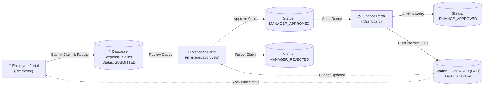
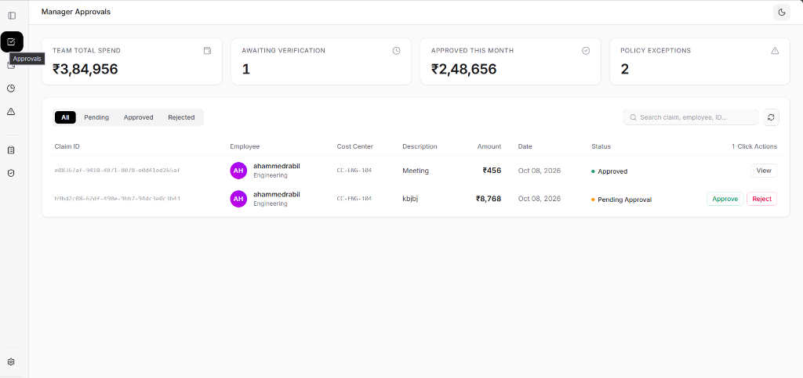

# Expense Management System

An integrated Expense Management System featuring a multi-role workflow for **Employees**, **Managers**, and **Finance Admins**. The platform streamlines corporate spending from receipt capture to manager policy reviews, treasury verification, and bank disbursement settlement.

---

## 📑 Table of Contents
1. [System Architecture & Lifecycle](#-system-architecture--lifecycle)
2. [Core Portals](#-core-portals)
3. [Skills & Tech](#-skills--tech)
4. [Project Structure](#-project-structure)
5. [Prerequisites & Installation](#-prerequisites--installation)
6. [Running the Application](#-running-the-application)
7. [API Documentation](#-api-documentation)
8. [Database & Storage Setup](#-database--storage-setup)
9. [Key Features & Policies](#-key-features--policies)
10. [Contributing & Git Workflow](#-contributing--git-workflow)

---

## 🔄 System Architecture & Lifecycle

The system connects all three enterprise personas through a single, unified data lifecycle:



### Claim Lifecycle Status Transitions:
| State | Trigger | Role Responsible | Visible In |
| :--- | :--- | :--- | :--- |
| `DRAFT` | Save progress | Employee | Employee Drafts |
| `SUBMITTED` | Submit expense with receipt | Employee | Manager Pending Queue |
| `MANAGER_APPROVED` | Review and approve claim | Manager | Finance Awaiting Verification |
| `MANAGER_REJECTED` | Decline with reason remark | Manager | Employee History (with reason) |
| `FINANCE_APPROVED` | Policy & GST invoice verified | Finance Admin | Ready for Treasury Payout |
| `HOLD` | Audit exception / invoice missing | Finance Admin | Exceptions & Audit Queue |
| `DISBURSED` / `PAID` | Settlement recorded with bank UTR | Finance Admin | Employee Paid Ledger & Budget Deducted |

---

## 🖥️ Core Portals

### 1. 👤 Employee Portal (`/employee`)
- **Quick Receipt Capture**: Upload invoice receipts (PDF, PNG, JPG, HEIC).
- **Expense Submission**: Categorize expenses (Travel, Hotel, Meals, Software, Equipment), enter business purpose, select corporate card or personal out-of-pocket payment methods.
- **Corporate Card Management**: View virtual cards, credit limits, card transactions, and request limit increases.
- **Real-Time Tracking**: Monitor the live approval progress of submitted claims from Manager Review to Treasury Payout.

### 2. 👔 Manager Portal (`/manager`)
- **Approvals Review Queue** (`/manager/approvals`): Filter by status (`Pending`, `Approved`, `Rejected`), inspect receipts, view GST credentials, and approve or reject claims with custom manager remarks.
- **Team Spend & Cost Centers**: Analyze departmental spend across cost centers (`CC-ENG-104`, `CC-PRD-201`, etc.).
- **Budget Thresholds**: Track departmental caps and receive automated warnings when spending exceeds 80%.
- **Policy Enforcement**: Automatic detection of accommodation over-caps, per diem meal breaches, and unauthorized luxury rentals.

<p align="center">
  
</p>

### 3. 💳 Finance & Treasury Portal (`/dashboard`)
- **Treasury Overview**: Headline KPIs including Awaiting Verification count, Approved Amount Total, Pending Reimbursements, and Audit Exceptions.
- **Audit & Compliance Queue**: Deep inspection of receipts, GSTIN verification, duplicate alerts, and tax compliance.
- **Hold & Send-Back**: Temporarily freeze claims or return them to employees for revision.
- **Disbursement & Payouts**: Record settlements via NEFT, RTGS, IMPS, or Corporate Card, attach bank UTR references, and automatically update department budgets.

---

## 🛠️ Skills & Tech

<p align="left">
  
  
  
  
  
  
  
  
  
  
  
  
  
  
  
  
  
</p>

### Frontend
- **Framework**: [Next.js](https://nextjs.org/) 16 (App Router)
- **Language**: [TypeScript](https://www.typescriptlang.org/)
- **UI & Styling**: [Tailwind CSS](https://tailwindcss.com/) v4, Lucide Icons, Framer Motion
- **Charts & Data Visualization**: [Recharts](https://recharts.org/)
- **Notifications**: [Sonner](https://sonner.emilkowal.ski/) Toasts

### Backend
- **Framework**: [FastAPI](https://fastapi.tiangolo.com/) (Python 3.10+)
- **Server**: [Uvicorn](https://www.uvicorn.org/) (Asynchronous ASGI)
- **Validation**: [Pydantic](https://docs.pydantic.dev/) v2
- **HTTP Client**: [HTTPX](https://www.python-httpx.org/)
- **OCR & Imaging**: PyTesseract, Pillow (PIL)

### Database & Storage
- **Database**: [Supabase](https://supabase.com/) (PostgreSQL with Row Level Security)
- **Object Storage**: Supabase Storage (`receipts` bucket)
- **Resilience**: In-memory synchronized fallback store for offline/demo reliability

---

## 📂 Project Structure

```plaintext
Exepensive-Managment-System/
├── backend/
│   ├── app/
│   │   ├── api/                     # REST API Endpoints
│   │   │   ├── approvals.py         # Manager Approvals API
│   │   │   ├── budgets.py           # Department Budgets API
│   │   │   ├── employee_auth.py     # Employee Auth & Session API
│   │   │   ├── employee_workspace.py# Employee Cards, Analytics & Reports API
│   │   │   ├── expenses.py          # Team Spend Summaries API
│   │   │   ├── finance.py           # Finance Treasury & Audit API
│   │   │   ├── policies.py          # Expense Policy Rules API
│   │   │   ├── reports.py           # Quarterly Financials API
│   │   │   └── supabase_new_expense.py # Receipt Upload & Claim Creation API
│   │   ├── core/
│   │   │   └── config.py            # Environment configuration & settings
│   │   ├── schemas/                 # Pydantic Request & Response models
│   │   │   ├── approval.py
│   │   │   ├── budget.py
│   │   │   ├── expense.py
│   │   │   ├── finance.py
│   │   │   └── report.py
│   │   ├── services/                # Business logic layer
│   │   │   ├── approval_service.py  # Manager approval actions
│   │   │   ├── finance_service.py   # Treasury verification & disbursement
│   │   │   ├── shared_store.py      # Unified shared store across modules
│   │   │   ├── supabase_expenses.py # Supabase gateway & storage uploads
│   │   │   └── report_service.py    # Quarterly aggregation
│   │   ├── main.py                  # FastAPI application entry point
│   │   └── supabase.py              # Supabase client factory
│   ├── requirements.txt             # Python dependencies
│   └── .env.example                 # Backend environment template
├── frontend/
│   ├── app/                         # Next.js App Router pages
│   │   ├── dashboard/               # Finance Portal page
│   │   ├── employee/                # Employee Portal page
│   │   ├── manager/                 # Manager Dashboard & Views
│   │   │   └── approvals/           # Manager Approvals Review Queue
│   │   └── layout.tsx               # Root layout & providers
│   ├── components/                  # Reusable UI component modules
│   │   ├── dashboard/               # Finance dashboard widgets
│   │   ├── manager/                 # Manager widgets & modals
│   │   └── shared/                  # Shared status badges & headers
│   ├── lib/                         # State management & client APIs
│   │   ├── api.ts                   # Supabase claim helpers
│   │   ├── employee-api.ts          # Employee authenticated client
│   │   ├── finance-store.tsx        # Finance Context & state machine
│   │   ├── manager-api.ts           # Manager backend API client
│   │   └── mock-data.ts             # Baseline seed data
│   ├── src/                         # Employee Portal feature modules
│   │   └── features/
│   │       ├── expenses/            # New expense form & upload
│   │       ├── overview/            # Employee personal overview
│   │       └── cards/               # Virtual corporate cards
│   ├── package.json                 # Node dependencies & scripts
│   └── .env.local.example           # Frontend environment template
├── docs/                            # Documentation assets & screenshots
│   └── screenshots/                 # Application screenshots
├── supabase/                        # Database migrations & schemas
│   ├── schema_and_seed.sql          # Complete schema, RLS policies & initial seed
│   └── seed.sql                     # Seed data for policies and budgets
└── README.md                        # Documentation
```

---

## ⚡ Prerequisites & Installation

### 1. Prerequisites
- **Node.js**: v18.0.0 or higher
- **npm**: v9.0.0 or higher
- **Python**: v3.10.0 or higher
- **Git**

### 2. Clone the Repository
```bash
git clone https://github.com/Rabil009/Exepensive-Managment-System.git
cd Exepensive-Managment-System
```

### 3. Backend Setup
1. Open a terminal in the `backend/` directory:
   ```bash
   cd backend
   ```
2. Create and activate a Python virtual environment:
   ```bash
   # Windows (PowerShell)
   python -m venv .venv
   .\.venv\Scripts\Activate.ps1

   # Linux / macOS
   python3 -m venv .venv
   source .venv/bin/activate
   ```
3. Install dependencies:
   ```bash
   pip install -r requirements.txt
   ```
4. Configure environment variables:
   ```bash
   cp .env.example .env
   ```
   *Edit `.env` and provide your Supabase URL and credentials:*
   ```env
   SUPABASE_URL=https://your-project-id.supabase.co
   SUPABASE_KEY=your_supabase_anon_key
   PORT=8000
   HOST=0.0.0.0
   ENVIRONMENT=development
   ```

### 4. Frontend Setup
1. Open a terminal in the `frontend/` directory:
   ```bash
   cd frontend
   ```
2. Install dependencies:
   ```bash
   npm install
   ```
3. Configure environment variables:
   ```bash
   cp .env.local.example .env.local
   ```
   *Edit `.env.local`:*
   ```env
   NEXT_PUBLIC_SUPABASE_URL=https://your-project-id.supabase.co
   NEXT_PUBLIC_SUPABASE_ANON_KEY=your_supabase_anon_key
   NEXT_PUBLIC_API_URL=http://localhost:8000
   NEXT_PUBLIC_BACKEND_URL=http://localhost:8000/api/manager
   ```

---

## 🚀 Running the Application

### 1. Start the Unified FastAPI Backend
From the `backend/` folder:
```bash
python -m uvicorn app.main:app --host 127.0.0.1 --port 8000 --reload
```
*Backend will be running at:* `http://127.0.0.1:8000`  
*Interactive Swagger Documentation:* `http://127.0.0.1:8000/docs`

### 2. Start the Next.js Frontend
From the `frontend/` folder:
```bash
npm run dev
```
*Frontend will be running at:* `http://localhost:3000`

### 3. Portal Navigation Links
| Role | Portal Link | Description |
| :--- | :--- | :--- |
| **Manager Portal** | `http://localhost:3000/manager` | Main Manager Dashboard |
| **Manager Approvals** | `http://localhost:3000/manager/approvals` | Review & Approve claims |
| **Finance Admin** | `http://localhost:3000/dashboard` | Treasury audit & disbursement |
| **Employee Portal** | `http://localhost:3000/employee` | Submit expenses & cards |
| **Backend API Docs** | `http://127.0.0.1:8000/docs` | Interactive Swagger API explorer |

---

## 📡 API Documentation

FastAPI automatically generates interactive Swagger documentation available at `/docs`. Below is a reference of the primary endpoints:

### System Endpoints
| Method | Endpoint | Description |
| :--- | :--- | :--- |
| `GET` | `/health` | Server health check and version info |
| `GET` | `/docs` | Interactive Swagger UI |

### Manager Endpoints (`/api/manager`)
| Method | Endpoint | Description |
| :--- | :--- | :--- |
| `GET` | `/api/manager/approvals` | List claims pending manager review (supports `status`, `department`, `search` filters) |
| `GET` | `/api/manager/approvals/{claim_id}` | Retrieve single claim details |
| `POST` | `/api/manager/approvals/{claim_id}/approve` | Approve a claim with optional manager remarks |
| `POST` | `/api/manager/approvals/{claim_id}/reject` | Reject a claim with mandatory reason |
| `GET` | `/api/manager/budgets` | Department budgets and spend status |
| `GET` | `/api/manager/expenses/summary` | Team spend KPI metrics |
| `GET` | `/api/manager/reports/quarterly` | Quarterly financial audit statements |

### Finance Endpoints (`/api/finance`)
| Method | Endpoint | Description |
| :--- | :--- | :--- |
| `GET` | `/api/finance/overview` | Finance dashboard headline metrics |
| `GET` | `/api/finance/claims` | List claims for audit review |
| `POST` | `/api/finance/claims/{claim_id}/verify` | Verify, approve, reject, or send back claim |
| `POST` | `/api/finance/claims/{claim_id}/hold` | Place or release audit hold on claim |
| `POST` | `/api/finance/disburse` | Execute payout disbursement, record bank UTR, and deduct budget |
| `GET` | `/api/finance/budgets` | Fetch departmental spend utilization |
| `GET` | `/api/finance/reimbursements` | List reimbursement queue and payout records |
| `GET` | `/api/finance/exceptions` | Flagged claims with policy violations or duplicate alerts |

### Employee Endpoints (`/api/employee`)
| Method | Endpoint | Description |
| :--- | :--- | :--- |
| `POST` | `/api/employee/new-expense` | Save draft or submit new expense with receipt |
| `GET` | `/api/employee/new-expense/options` | Available categories, reports, and unlinked card transactions |
| `GET` | `/api/employee/overview` | Employee personal expense summary and recent claims |
| `GET` | `/api/employee/cards` | Assigned corporate cards and monthly limits |

---

## 🗄️ Database & Storage Setup

The database schema and initial seed data are managed in the `supabase/` directory:

1. **`supabase/schema_and_seed.sql`**:
   - Creates `profiles`, `expense_claims`, `department_budgets`, `expense_policies`, `reimbursement_records`, and `audit_logs` tables.
   - Configures automated timestamps and triggers.
   - Enables Row Level Security (RLS) policies for user, manager, and finance roles.
   - Creates the Supabase Storage bucket `receipts` for file attachments.
   - Inserts baseline policies and Q4 2026 departmental budgets.

To apply this to your Supabase project, execute the SQL script in your Supabase SQL Editor.

---

## 🛡️ Key Features & Policies

- **Single Source of Truth**: Changes made by Managers immediately reflect in Finance queues, and settlements update budgets in real time.
- **Automated Policy Checks**:
  - Nightly Hotel accommodation limit: ₹5,000/night.
  - Per diem meals limit: ₹2,500/day.
  - Mandatory receipt requirement for any expense over ₹500.
  - Automated duplicate transaction warnings for charges at identical merchants within 48 hours.
- **Audit Trails**: Complete historical log tracing who approved, rejected, placed holds, or disbursed payments, with timestamps and remarks.

---

## 🤝 Contributing & Git Workflow

- **`main`**: Production-ready branch with all modules consolidated.
- **`Tejaswini`**: Manager Backend & Frontend integration.
- **`devlop-aditya`**: Finance Module & Treasury features.
- **`Rabil`**: Employee Portal & Workspace features.

### Contribution Guidelines
1. Ensure your local branch is rebased on latest `main`.
2. Verify both the FastAPI backend and Next.js frontend compile cleanly without TypeScript or linting errors.
3. Test the end-to-end claim approval flow from Employee submission to Treasury disbursement.